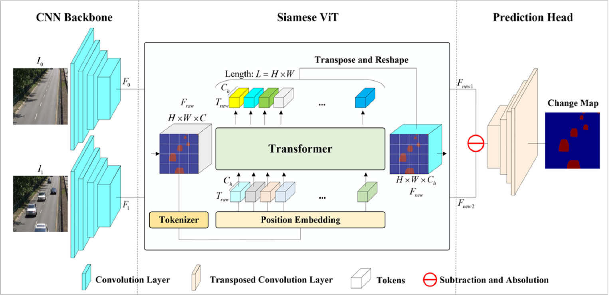
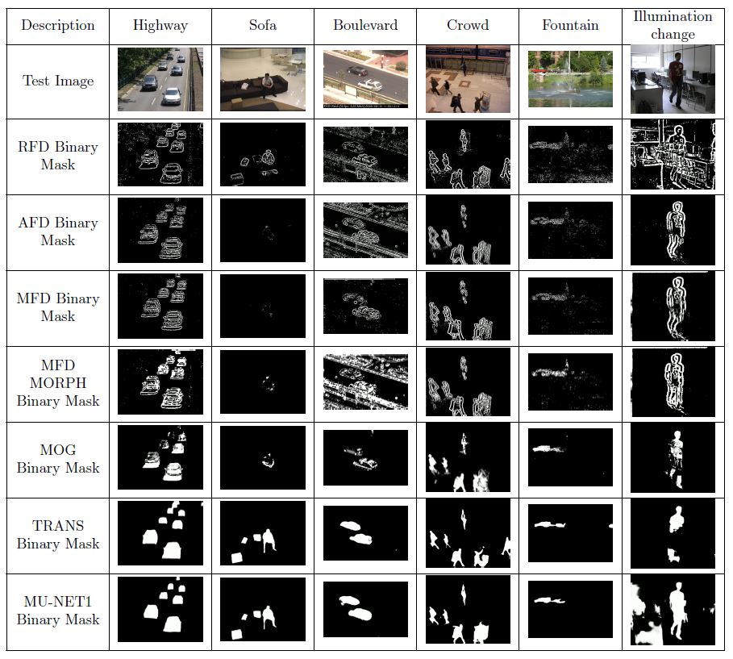

# Motion Detection Algorithm Evaluation

This repository contains the implementation and evaluation of various motion detection algorithms, including traditional background subtraction techniques and state-of-the-art deep learning models. The project assesses the strengths and limitations of these approaches on benchmark datasets for motion detection tasks. For more details, refer to the [full report](report.pdf) included in this repository.

## Table of Contents
- [Datasets](#datasets)
- [Traditional Approaches](#traditional-approaches)
- [Deep Learning Approaches](#deep-learning-approaches)
- [Results](#results)

## Datasets
The following benchmark datasets were used for evaluation:
1. [Change Detection 2014 (CD2014)](http://jacarini.dinf.usherbrooke.ca/dataset2014)
2. [Scene Background Modeling (SBMnet)](http://pione.dinf.usherbrooke.ca/dataset)

These datasets include video sequences with varying environments, lighting conditions, and levels of clutter. Ground truth annotations are provided to label regions as foreground (moving objects) or background. For more information about the datasets and their characteristics, refer to the [report](report.pdf).

## Traditional Approaches
The following traditional algorithms for motion detection are implemented:
- **Frame Differencing**
  - Reference Frame Differencing (RFD)
  - Adjacent Frame Differencing (AFD)
  - Median Frame Differencing (MFD)
  - Median Frame Differencing with Morphology (MFD-M)
- **Mixture of Gaussians (MOG)**

These approaches are detailed in the [report](report.pdf), which includes descriptions of the algorithms and their implementations.

## Deep Learning Approaches
### 1. TransCD: Transformer-based Scene Change Detection
A transformer-based architecture for scene change detection. It uses a CNN backbone, Siamese Vision Transformer (SViT), and a prediction head to generate binary change maps from bi-temporal images.

For an in-depth explanation of this model, see the [report](report.pdf).

### 2. MU-Net1: Single-stream Motion Detection Using Semantic Segmentation
A U-Net-like architecture for motion detection, leveraging ResNet-18 as the backbone. It uses encoder-decoder modules with skip connections to accurately segment moving objects.

For more details about MU-Net1, refer to the [report](report.pdf).

## Results
### Qualitative Comparison
Sample outputs from traditional and deep learning methods were qualitatively evaluated. The comparison below highlights their performance on challenging scenarios.

### Observations
- **Traditional Methods**:
  - RFD and AFD are computationally efficient but struggle with dynamic backgrounds and noise.
  - MFD improves robustness using temporal information, while MFD-M refines masks using morphological operations.
  - MOG adapts well to gradual scene changes but is computationally intensive.
- **Deep Learning Models**:
  - TransCD and MU-Net1 outperform traditional methods in complex scenes with occlusions and varying lighting conditions.
  - However, these models require significant computational resources for real-time deployment.

For additional discussion and evaluation procedures, consult the [report](report.pdf).
